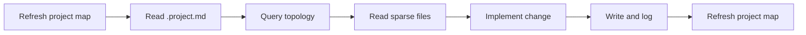

# Project Context Map MCP

<div align="center">

### Give your coding agent a map before it starts wandering

Turn a repository into structured project memory for MCP clients like Claude Code, so they can query context, inspect only relevant files, and understand topology before touching code.

[](#installation)
[](#mcp-tools)
[](#what-it-generates)
[](#topology--visual-graph)

</div>

---

## Why This Exists

AI coding tools often begin the same way in a medium or large repo:

- they read too many files
- they spend tokens on unrelated areas
- they rebuild context from scratch every time
- they miss the real dependency chain behind a feature or bug

`project-context-map-mcp` fixes that by generating a lightweight project memory and exposing it through MCP tools.

Instead of:

`scan everything -> guess -> open random files`

you get:

`index first -> query topology -> read sparse files -> edit with context`

---

## What This Project Does

This package gives you:

- an MCP server for project-aware queries
- a CLI to generate and refresh repository memory
- a readable `.project.md` with topology highlights and change log
- a machine-readable `.project-map.json`
- a human-readable `.project-map.md`
- import/dependency relationships between files
- sparse file access limited to indexed paths
- MCP-assisted writes with automatic logging
- Claude Code setup helpers and skill generation

---

## At A Glance

| Part | Purpose |
| --- | --- |
| `.project.md` | Main readable project memory for humans and agents |
| `.project-map.json` | Structured index used by tools |
| `.project-map.md` | Lightweight markdown summary |
| `read_project_context` | Returns `.project.md` |
| `query_topology` | Finds relevant files from natural-language queries |
| `read_files_sparse` | Reads only indexed files |
| `write_and_log` | Writes changes and appends to `.project.md` Change Log |

---

## Installation

### Option 1: Global install

Best if you want to use it across many repositories.

```bash
npm install -g project-context-map-mcp
```

### Option 2: Local install

Best if you want it only inside one project.

```bash
npm install project-context-map-mcp
```

### Requirements

- Node.js `20` or newer
- an MCP-compatible client such as Claude Code

---

## Quick Start

### 1. Generate the project memory

Run this from the root of the repo you want to index:

```bash
project-context-map-mcp refresh --project-root .
```

This creates:

- `.project.md`
- `.project-map.json`
- `.project-map.md`

### 2. Configure Claude Code for that repo

```bash
project-context-map-mcp configure-claude --project-root .
```

This creates or updates:

- `.mcp.json`
- `.claude/skills/project-context-map/SKILL.md`

### 3. Start the MCP server

If your client starts the server from `.mcp.json`, you usually do not need to run it manually.

If you want to run it yourself:

```bash
project-context-map-mcp serve --project-root .
```

### 4. Use it from your MCP client

Typical flow:

1. read the project context
2. query topology with a natural-language task
3. read only the matched files
4. make changes
5. refresh the map

Prompt examples:

- See [PROMPTS.md](./PROMPTS.md) for tested starter prompts for Claude Code, Cursor, and VS Code Copilot Chat.
- For best results, use prompts that name the feature area, module, or source files you want the agent to inspect.

---

## MCP Config

If you want to wire the server manually, add this to your MCP config:

```json
{
  "mcpServers": {
    "project-context-map": {
      "command": "project-context-map-mcp",
      "args": ["serve", "--project-root", "."],
      "env": {}
    }
  }
}
```

### Generate it automatically

```bash
project-context-map-mcp print-mcp-config --project-root .
```

### Write it into the repo

```bash
project-context-map-mcp configure-claude --project-root .
```

---

## CLI Commands

```bash
project-context-map-mcp serve --project-root .
project-context-map-mcp refresh --project-root .
project-context-map-mcp install-hooks --project-root .
project-context-map-mcp configure-claude --project-root .
project-context-map-mcp print-mcp-config --project-root .
project-context-map-mcp help
```

<details>
<summary><strong>Command details</strong></summary>

| Command | What it does |
| --- | --- |
| `serve` | Starts the MCP server over stdio |
| `refresh` | Regenerates `.project.md`, `.project-map.json`, and `.project-map.md` |
| `install-hooks` | Installs git hooks to keep the map refreshed |
| `configure-claude` | Creates repo-local Claude Code skill and `.mcp.json` |
| `print-mcp-config` | Prints the MCP config JSON without writing files |
| `help` | Shows command help |

</details>

---

## MCP Tools

These are the main tools exposed by the server.

### Core workflow tools

| Tool | Purpose |
| --- | --- |
| `read_project_context` | Returns `.project.md` content |
| `query_topology` | Takes a natural-language query and returns matched file paths from the query index |
| `read_files_sparse` | Reads file content only for indexed paths |
| `write_and_log` | Writes file changes and appends an entry to `.project.md` Change Log |

### Additional tools

| Tool | Purpose |
| --- | --- |
| `get_project_summary` | Returns summary, stack, modules, hotspots |
| `refresh_project_map` | Regenerates the project memory artifacts |
| `get_module_context` | Returns a focused view of one module |
| `find_relevant_files` | Legacy ranking-oriented file query |
| `get_recent_git_changes` | Summarizes recent git activity |
| `explain_file_role` | Explains a file’s role and recent changes |

<details>
<summary><strong>What each core tool returns</strong></summary>

### `read_project_context`

Returns:

- `.project.md` path
- full markdown content

### `query_topology`

Returns:

- matched file paths
- confidence score
- match reasons
- per-file dependencies
- per-file `usedBy` relationships

### `read_files_sparse`

Returns:

- file content for indexed files
- safe errors for files outside the repo or outside the known topology

### `write_and_log`

Returns:

- path written
- bytes written
- appended change log entry

</details>

---

## Recommended Workflow



### Example task flow

User asks:

```text
Fix the login bug where session expires after refresh
```

Recommended agent behavior:

1. call `read_project_context`
2. call `query_topology` with the task
3. call `read_files_sparse` with the matched file paths
4. inspect only those files first
5. edit code
6. call `write_and_log` if using MCP-managed writes
7. call `refresh_project_map`

---

## Topology & Visual Graph

The project map is not only a file list. It also extracts internal relationships such as:

- JavaScript and TypeScript imports
- CommonJS `require(...)` usage
- basic Python import detection
- reverse usage information with `used_by`

That data is written into:

- `.project-map.json`
- `.project.md`

`.project.md` includes a Mermaid graph so markdown viewers that support Mermaid can render a visual dependency map.

---

## What It Generates

### `.project.md`

The main working document. It includes:

- project summary
- key modules
- query index preview
- topology highlights
- Mermaid dependency graph
- running change log

### `.project-map.json`

The structured source of truth. It includes fields such as:

- `project_summary`
- `tech_stack`
- `modules`
- `files`
- `topology`
- `entrypoints`
- `dependencies`
- `recent_changes`
- `hotspots`

### `.project-map.md`

A shorter human-readable summary.

---

## Claude Code Setup

After running:

```bash
project-context-map-mcp configure-claude --project-root .
```

your repo will contain:

```text
.mcp.json
.claude/skills/project-context-map/SKILL.md
```

The generated skill tells Claude Code to:

- consult project memory first
- avoid broad repo scans
- query relevant files before opening source
- refresh the project map after edits

---

## Git Hooks

If you want the map to stay fresh automatically:

```bash
project-context-map-mcp install-hooks --project-root .
```

This installs:

- `post-commit`
- `post-merge`
- `post-push`

Each hook refreshes the project memory after repository activity.

---

## Interactive Setup Guide

<details open>
<summary><strong>I just installed it. What should I do next?</strong></summary>

1. Go to your repo root.
2. Run `project-context-map-mcp refresh --project-root .`
3. Run `project-context-map-mcp configure-claude --project-root .`
4. Open the repo in Claude Code.
5. Approve the MCP server from `.mcp.json`.
6. Ask the agent to use `read_project_context` and `query_topology` first.

</details>

<details>
<summary><strong>I want to use my own MCP config instead of the generated one</strong></summary>

Use:

```bash
project-context-map-mcp print-mcp-config --project-root .
```

Then copy the JSON into your own MCP config file and adjust:

- server name
- command path
- working project root

</details>

<details>
<summary><strong>I only want the package inside one repo</strong></summary>

Install locally:

```bash
npm install project-context-map-mcp
```

Then run through `npx`:

```bash
npx project-context-map-mcp refresh --project-root .
npx project-context-map-mcp configure-claude --project-root .
```

</details>

<details>
<summary><strong>How do I know it is working?</strong></summary>

You should see:

- `.project.md`
- `.project-map.json`
- `.project-map.md`
- `.mcp.json` after Claude setup

You can also run:

```bash
project-context-map-mcp help
project-context-map-mcp refresh --project-root .
```

</details>

---

## Example Prompts For Your MCP Client

Tested prompt templates now live in [PROMPTS.md](./PROMPTS.md).

Quick examples:

- `Use the project context map first, then find the files involved in session refresh logic.`
- `Use query_topology to locate the files related to npm publishing, package configuration, and release safety checks.`
- `Use get_module_context for src and explain how the CLI and MCP server fit together.`
- `Find the files that control authentication and prefer source files over docs.`

---

## Best Fit Repositories

- Node.js applications
- React apps
- Next.js projects
- mixed frontend/backend repos
- Python services
- large internal tools where AI agents are used often

---

## Local Development

```bash
npm install
npm run check
node src/cli.js refresh --project-root .
node src/cli.js serve --project-root .
```

---

## Current Limitations

- topology detection is strongest for JS, TS, and simple Python import patterns
- visual graph output is Mermaid markdown, not a full interactive web app
- natural-language ranking quality depends on file names, summaries, tags, and recent changes

---

## License

MIT
